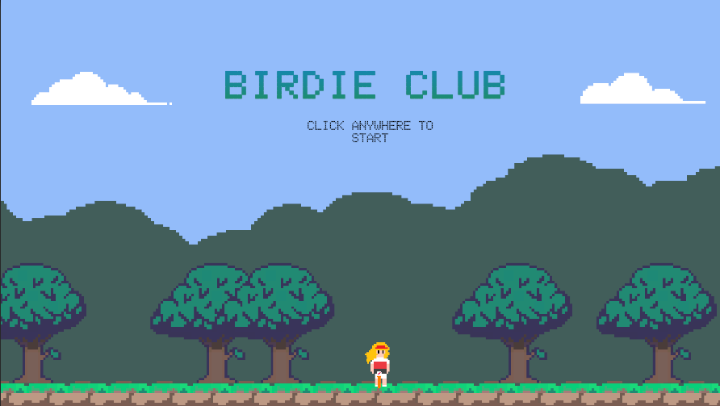
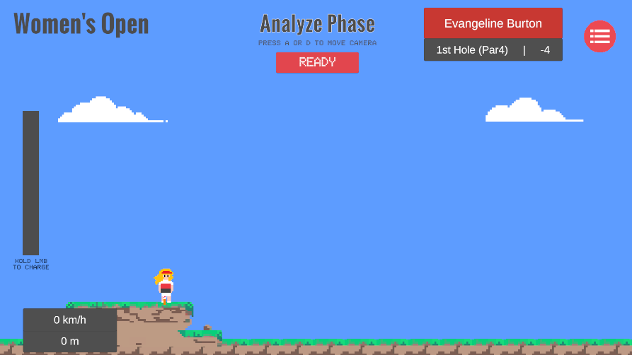
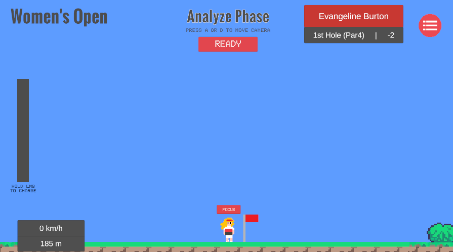
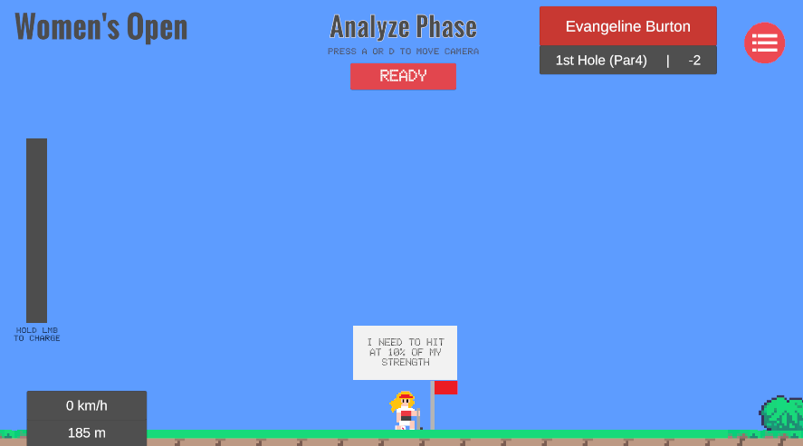
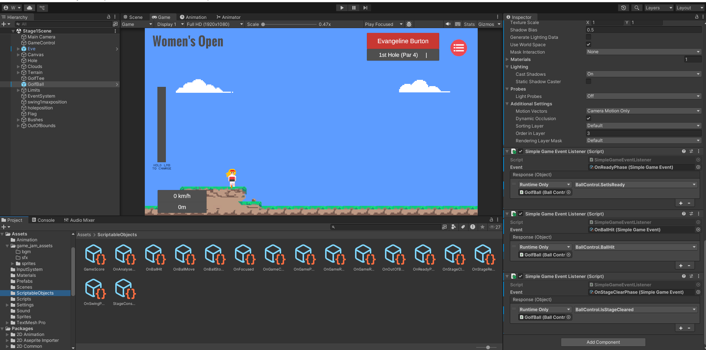
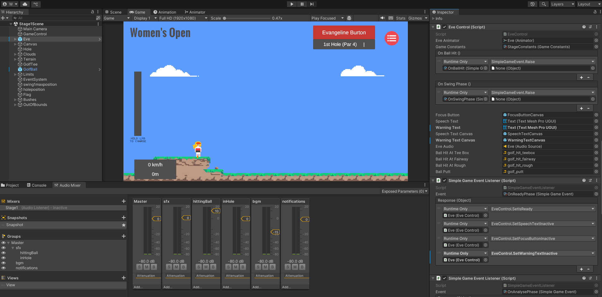

# **Game Title**

Birdie Club

## **How to Run**

- System requirements: Windows
- Unity Version: 2022.3.47f1
- **Executable file** of the game to download _(Ensure it is playable without extra setup.)_

https://drive.google.com/file/d/1vJl84qgS6LthiB_XEWyTsEXyPnoYqnUL/view?usp=sharing

### Gameplay Recording

You should provide a link to your **Full gameplay recording** showing mechanics, UI/UX, and polish. _(A complete playthrough is required.)_ here.

https://youtu.be/BQtsA7WM8HA

## Chosen Theme

Simplicity is Key. This is a golf game using physics and golf scoring rules.

## Twist

_(Add a second action. The second action should complement the first mechanic, which expands their core gameplay without breaking simplicity)

I added an additional action to allow the players to gain a hint while on the green (the area around the hole). This mimics how actual golf players will "read the green" to determine the best way to putt the ball into the hole.

## Game Description

_(Briefly describe your game’s premise, setting, and goal. What is the game about? What experience should the player have?)_

This is a golf game where players play as a golfer in a golf tournament. The objective is to complete the golf course (consists of multiple holes) in as few strokes as possible to obtain the highest possible score. This game is designed to be as close to an actual golf match as possible, with rules and scoring system matching those in a golf match. In this game, players are to experience what its like playing golf in a video game.

## **Core Mechanic**

_(What is the core mechanic? Use the core mechanics described in class. Then you can describe the main action players perform repeatedly that drives gameplay. Example: "Jumping between platforms to avoid obstacles" or "Controlling a spaceship to dodge and shoot enemies.")_

Tactical Choice: Players need to analyse the golf course to decide where to land the ball in order to avoid obstacles.

Measurement: Players have to calculate the angle and amount of force required to hit ball so that it can reach the desired distance. The ball's movement utilize Unity's physics system hence players will be able to calculate the ball's trajectory with practice.

## **Game Procedure & Controls**

_(How does the player navigate the game? What are the controls? Provide a list of inputs and their functions.)_

A key: Move camera to the left

D key: Move camera to the right

Hold Left Mouse Button: Increase the amount of force applied to the ball

Mouse Cursor: Control the angle which the ball will be hit

Click on Focus Button while on green: Gain a hint 

## **Core Drive (Tally with Design Principles, Balance, and Intentional Design)**

_(What **motivates** the player to engage with your game? Relate this to the Octalysis Framework or other motivational principles.)_

Development & Accomplishment: Players are motivated to complete the golf course in as few strokes as possible to achieve a better score. Players get better the more times they play the game as they get used to the physics of the ball as well as the layout of the golf course.

## **Game Balance Efforts (Tally with Rubric)**

_(What balance considerations were made in the game? Did you focus on PvP balance, PvE balance, asymmetry, statistical balance, risk vs. reward, skill balance, or economic balance? Explain how you implemented or adjusted game balance.)_

This game focuses on risk vs. reward and skill balance.

Risk vs. Reward: Some parts of the golf course contain obstacles to obstruct players and prevent them from obtaining a better score. These obstacles come in the form of sand pits (ball have a hard time travelling through this area due to high drag value), trees (they may block the ball) or bushes (same as sand pit but a different drag value). Players need to decide whether to risk hitting the ball hard so that it travels as far as possible (but it may land in one of these obstacles) or play it safe to try and control where the ball lands. Either way, players will play in a way that guarantees them the lowest amount of strokes used.

Skill Balance: This is a skill-based game where the ball uses Unity's physics engine and each golf course is fixed. This means that skilled players who are good at calculating the ball's movement will be able to complete the golf course in fewer strokes than less skilled players (just like the real sport). Whereas veteran players (those who have played the game multiple times) will know exactly where the ball lands depending on the angle and amount of force selected.

## **Unique Rule (Tally with Rubric)**

_(What unique rule did you introduce? Did you apply an elegant rule, break a conventional rule, or create asymmetry? Describe how this rule impacts gameplay and how it aligns with the rubric.)_

This game has an elegant rule of - hit ball hard, ball travel far.

## **Game Design Principles Incorporated**

_(Which design principles from class were intentionally applied? List at least one and explain how it enhances the player’s experience.)_

Interface Design: The UI is based on actual golf competition broadcast interface where information such as the player's name, ball speed, ball travel distance, hole number and player score is shown.

Structures and progression: The multiple game stages represent the different holes in a full 18-hole golf course (only 2 holes were completed for this demo).

Grounding the player: The player has a clear goal to hit the ball into the hole. The camera follows the ball's position when it is moving. 

## Code Cleanliness Efforts (Bonus)

_Outline your code architecture here and attempt to organise your code that suits your game. Be concise and clear. Leave this section blank if you are not doing this bonus part._

My code follows the Scriptable Object Architecture. SO architecture and unity events allow my scripts to be independent of each other and makes it easier for me to test different game scenes since the scenes are also decoupled from one another, unlike Singleton or Static architecture.

While I did not use FSM (the one taught in class), I did implement my game based on the same principles where the golf ball have different states - ballIsHit, ballStopped. The game is also split into different phases - AnalysePhase, ReadyPhase, SwingPhase, BallStoppedPhase and StageClearPhase. Player actions and UI interactions are determined by the phase of the game.

While this is not code based, I have utilized Audio Mixer to adjust the ingame sfx and music so that there is a balance in sound volume where one side is not too loud or too soft.

## Credits
Sprites such as the character, ball and flag were drawn by myself. Any other sprites used such as the tiles, were provided by the prof.
The sound and bgm is taken from royalty free websites Pixabay and mixkit.

